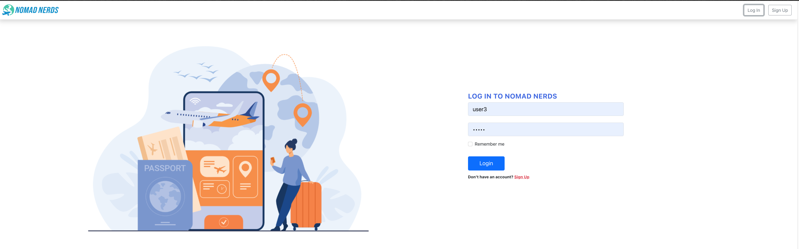
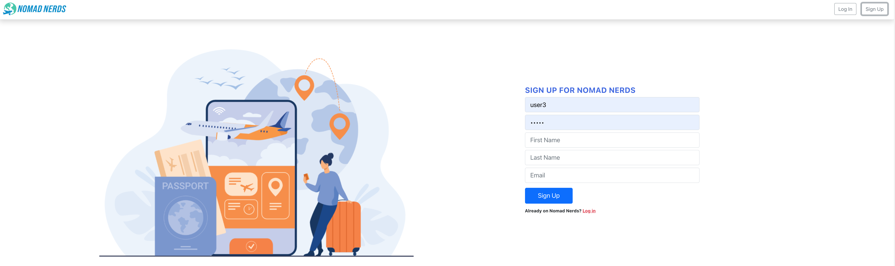
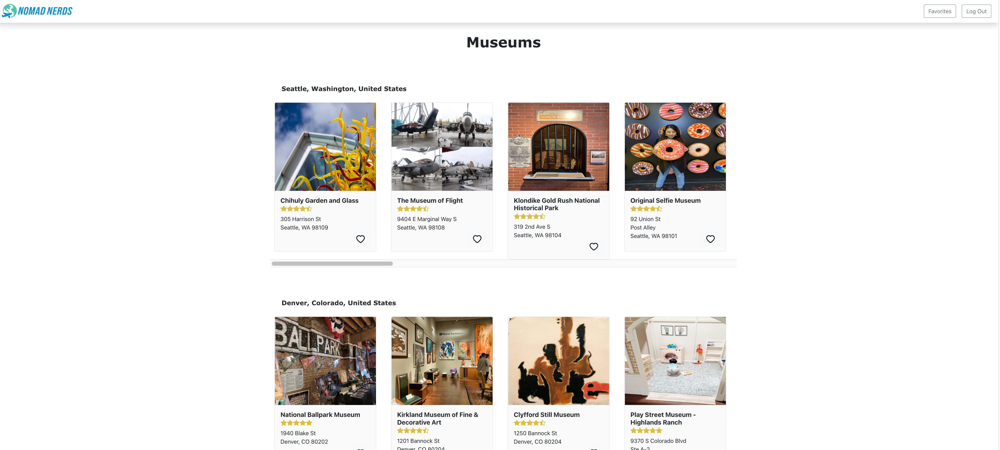
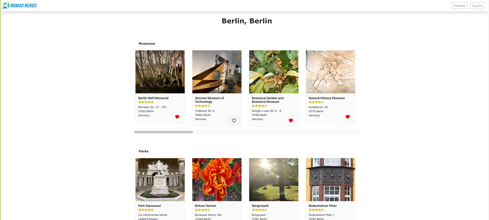
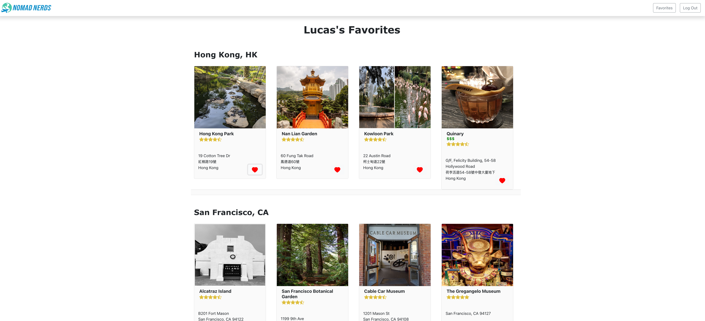

## Home page before login

This is the home page that people will see when they get to the Web site.  The user can search categories based on a location or location based on categories.  Home page contains information about businesses within popular destinations. 

## Log in page

This is the log in page.

## Sign up page

This is the page where users can create an account.

## City list page

This is the page that contains a list of businesses and cities based on category search.  If logged in, users can add and delete businesses to their favorites.  The list is organized by each city. 

## Category list page

This is the page that contains a list of businesses and categories based on city search.  If logged in, users can add and delete businesses to their favorites. The list is organized by each category. 

## Favorite page 

This is the page that users can access their list of favorite businesses if they are logged in.  The list is organized by each city. 

